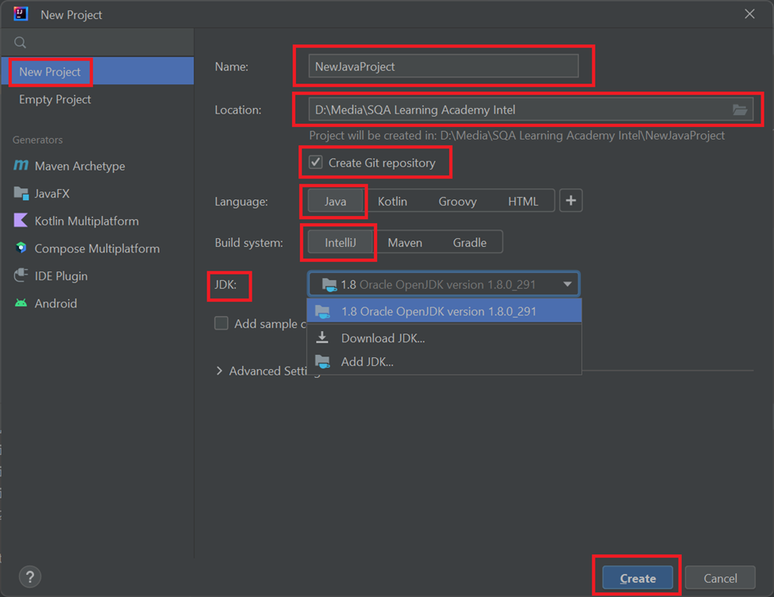

Create a new Java project
In IntelliJ IDEA, a project helps you organize your source code, tests, libraries that you use, build instructions, and your personal settings in a single unit.
1. Launch IntelliJ IDEA.
If the Welcome screen opens, click New Project.
Otherwise, from the main menu, select File | New Project.
2. In the New Project wizard, select New Project from the list on the left.
3. Name the project (for example HelloWorld) and change the default location if necessary.
4. If you want to create a Git repository make sure that you have checked the “Create Git repository” checkbox, otherwise leave the checkbox option as unchecked.
5. Make sure that the Java is selected in Language, and IntelliJ is selected in Build system.

6. To develop Java applications in IntelliJ IDEA, you need the Java SDK (JDK).
If the necessary JDK is already defined in IntelliJ IDEA, select it from the JDK list.
If the JDK is installed on your computer, but not defined in the IDE, select Add JDK and specify the path to the JDK home directory (for example, /Library/Java/JavaVirtualMachines/jdk-17.0.2.jdk).
If you don't have the necessary JDK on your computer, select Download JDK. In the next dialog, specify the JDK vendor (for example, OpenJDK), version, change the installation path if required, and click Download.

7. Leave the Add sample code option disabled as we're going to do everything from scratch in this tutorial. Click Create.

8. After that, the IDE will create and load the new project for you.
Create a package and a class
Packages are used for grouping together classes that belong to the same category or provide similar functionality, for structuring and organizing large applications with hundreds of classes.
9. In the Project tool window, right-click the src folder, select New (or press Alt+Insert), and then select Java Class.
10. In the Name field, type com.example.helloworld.HelloWorld and click OK.
IntelliJ IDEA creates the com.example.helloworld package and the HelloWorld class.
Together with the file, IntelliJ IDEA has automatically generated some contents for your class. In this case, the IDE has inserted the package statement and the class declaration.
This is done by means of file templates. Depending on the type of the file that you create, the IDE inserts initial code and formatting that is expected to be in all files of that type. For more information on how to use and configure templates, refer to File templates.

